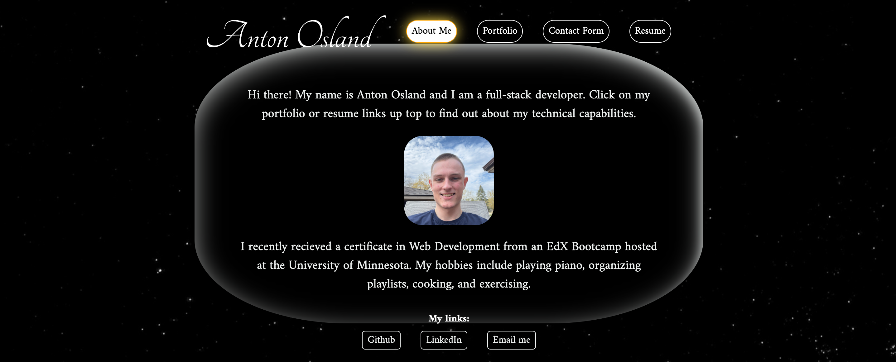

# Anton Osland React Portfolio

## Description

I built this site to have an updated portfolio, and to show off my skills with react. Through the creation of this site I became more comfortable using react and now have a better understanding of the technology.

## Installation

No need to install anything unless you would like to run the site locally, in that case clone the repo and do a simple `npm i` to download neccesary packages.

## Usage
[live site]()

To use the site simply go to the live site link and navigate the page!

